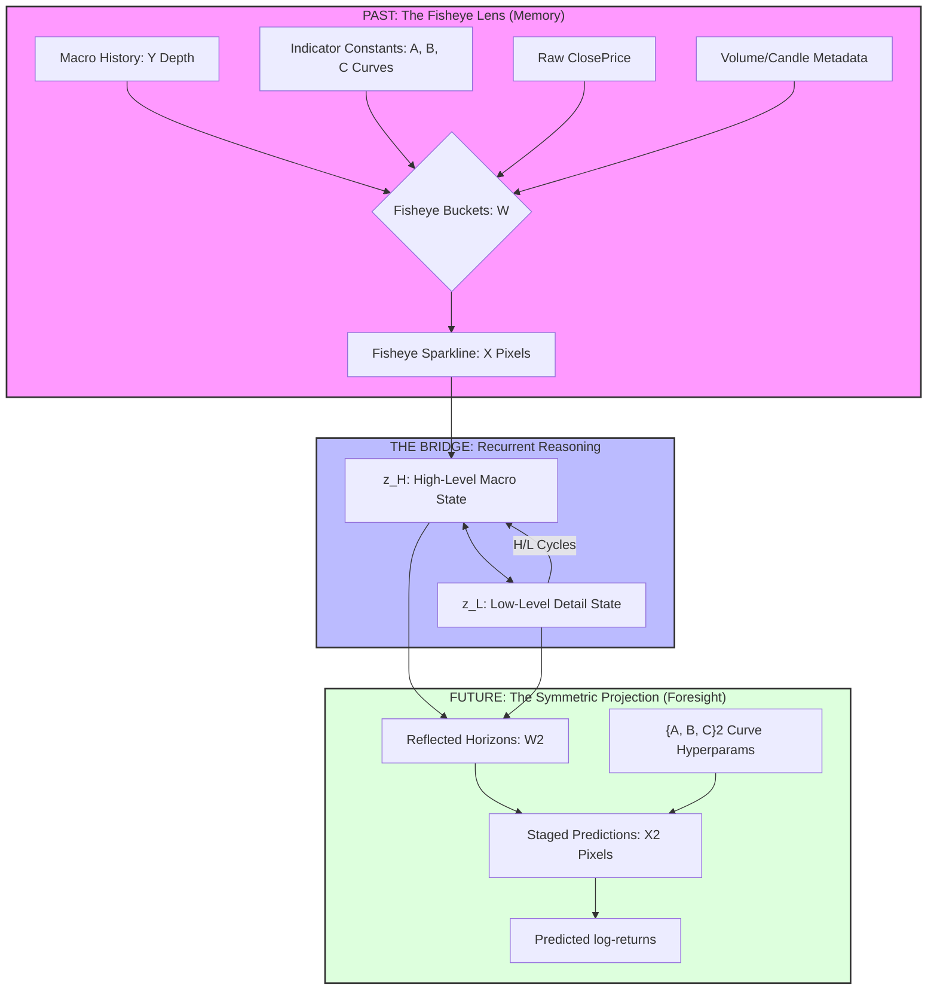

# Autotrade

**NO HEURISTICS. This system operates on pure model-driven logic. No hardcoded thresholds, no arbitrary constants, no rule-based 'patience', and no human-defined decision dampers are permitted. Every action must be an emergent property of the model's learning and the mathematical first principles of the environment.**

GAT-based force-directed coin graph trading with HRM (Hierarchical Reasoning Model).

## Symmetric World Model Architecture

The system treats past and future as a single, coherent physical entity. The resolution of the model's memory (Fisheye Lens) is mathematically mirrored into the resolution of its foresight (Staged Horizons).



### Key Technical Concepts:
- **Non-Frame Inputs**: The edge predictor integrates `VOLUME` and `CANDLE` junctures as exogenous variables, while `VOLUME` influence is implicitly baked into the historical `CLOSEPRICE` trajectory.
- **Hyperbolic X/Y**: The fisheye resolution (`X`) holds the historical depth (`Y`) using a power-law curvature (`A, B, C`) to emphasize recent entropy while maintaining macro-scale context.
- **Symmetric Mirroring**: The output horizons (`X2, Y2`) are the exact reflection of the input buckets. The model must bridge the gap between the macro "vanishing point" and the micro "present tense."
- **Entropy Exploitation**: Using a Hyperbolic Loss (Power 2.0+), the model ignores linear "sinewave" wiggles and rewards the capture of high-intensity outliers (spikes).

## Installation

```bash
uv sync
```

## Usage

Run the main simulation:
```bash
uv run autotrade
```

Run autonomous research (ANE-powered):
```bash
cd src/autotrade/research && uv run train.py
```
